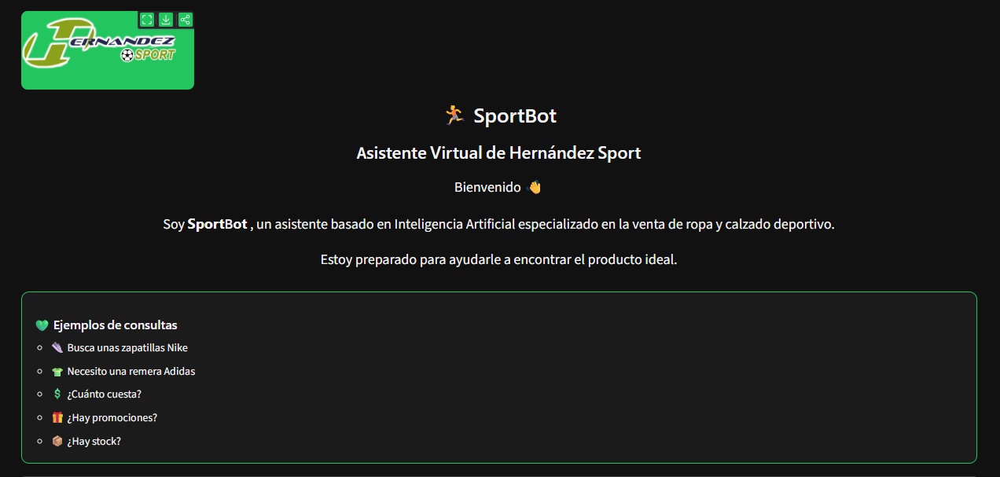
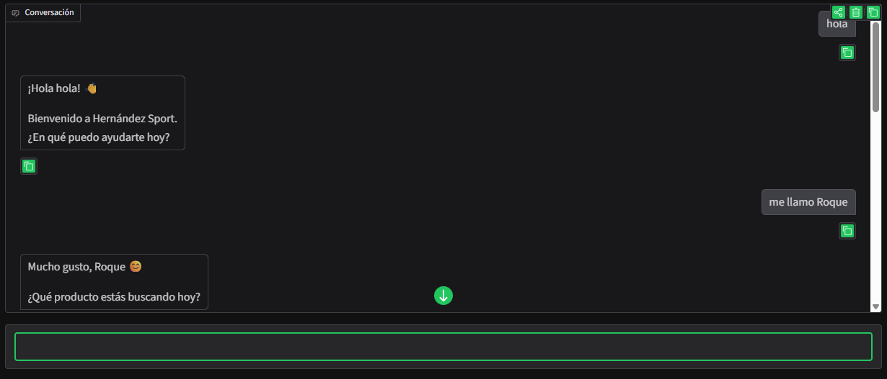

<p align="center">
  
</p>

# 🏃 SportBot

## Asistente Virtual Inteligente para Hernández Sport

---

# 📖 Descripción

SportBot es un chatbot desarrollado en Python como proyecto final de la materia **Procesamiento del Habla**.

El objetivo del sistema es asistir a los clientes de la tienda **Hernández Sport** mediante un asistente virtual capaz de comprender consultas escritas en lenguaje natural y brindar recomendaciones personalizadas sobre ropa y calzado deportivo.

Para ello se implementaron técnicas de Procesamiento del Lenguaje Natural (NLP), reconocimiento de entidades, memoria conversacional y una interfaz gráfica que permite una interacción sencilla e intuitiva con el usuario.

---

# 🎯 Objetivos

El proyecto tiene como objetivo desarrollar un asistente virtual capaz de:

- Comprender consultas escritas en lenguaje natural.
- Identificar productos, marcas, colores y talles.
- Recordar información del usuario durante la conversación.
- Recomendar productos deportivos.
- Consultar precios y promociones.
- Simular una experiencia de compra personalizada.

---

# 🛠 Tecnologías utilizadas

| Tecnología | Función |
|------------|---------|
| Python | Lenguaje principal del proyecto |
| spaCy | Procesamiento del Lenguaje Natural (NLP) |
| LangChain | Memoria conversacional |
| Gradio | Interfaz gráfica |
| JSON | Base de conocimiento del catálogo |
| Transformers | Soporte para modelos de lenguaje |

---

# 🏗 Arquitectura del sistema

```
                    Usuario
                        │
                        ▼
              Interfaz Gradio
                        │
                        ▼
                SportBot (chatbot.py)
                        │
        ┌───────────────┼────────────────┐
        ▼               ▼                ▼
Detección de      Extracción de     Memoria
Intenciones        Entidades         Conversacional
                    (spaCy)         (LangChain)
        └───────────────┼────────────────┘
                        ▼
                 Catálogo JSON
                        │
                        ▼
              Respuesta Personalizada
```

---

# ⚙ Funcionalidades

Actualmente SportBot permite:

- Saludar al usuario.
- Recordar el nombre del cliente.
- Detectar productos deportivos.
- Detectar marcas.
- Detectar colores.
- Detectar talles.
- Consultar el catálogo.
- Recomendar productos.
- Consultar precios.
- Consultar promociones.
- Consultar disponibilidad de stock.

---

# ⭐ Características

- Procesamiento del lenguaje natural.
- Memoria conversacional.
- Reconocimiento de entidades.
- Arquitectura modular.
- Catálogo de productos en formato JSON.
- Interfaz gráfica intuitiva.
- Fácil mantenimiento y ampliación.

---

# 📂 Estructura del proyecto

```
SportBot/

│── app.py
│── chatbot.py
│── entities.py
│── intents.py
│── memory.py
│── prompts.py
│── catalogo.json
│── logo.PNG
│── README.md
│── requirements.txt

├── test_chatbot.py
├── test_entities.py
└── test_memory.py
```

---

# 🚀 Instalación

## 1. Clonar el repositorio

```bash
git clone https://github.com/jacq_andr/SportBot.git
```

---

## 2. Ingresar al proyecto

```bash
cd SportBot
```

---

## 3. Crear un entorno virtual

```bash
python -m venv .venv
```

---

## 4. Activar el entorno virtual

### Windows (PowerShell)

```bash
.venv\Scripts\Activate
```

### Windows (CMD)

```bash
.venv\Scripts\activate.bat
```

### Linux / macOS

```bash
source .venv/bin/activate
```

---

## 5. Instalar las dependencias

```bash
pip install -r requirements.txt
```

---

## 6. Descargar el modelo de spaCy

```bash
python -m spacy download es_core_news_md
```

---

## 7. Ejecutar SportBot

```bash
python app.py
```

---

## 8. Abrir la aplicación

Abrir el navegador e ingresar a:

```
http://127.0.0.1:7860
```

---

# 💬 Ejemplos de uso

```
Hola
```

```
Me llamo Roque
```

```
Busco unas zapatillas Nike
```

```
Necesito una remera Adidas
```

```
¿Cuánto cuestan?
```

```
¿Hay promociones?
```

```
¿Hay stock?
```

---

## 📷 Capturas de pantalla

### Pantalla principal

<p align="center">
  
</p>

---

### Conversación con SportBot

<p align="center">
  
</p>

---

# 🔄 Flujo de funcionamiento

1. El usuario escribe una consulta.
2. SportBot detecta la intención del mensaje.
3. spaCy identifica las entidades relevantes.
4. LangChain administra la memoria conversacional.
5. Se consulta el catálogo de productos.
6. Se genera una respuesta personalizada.


---

# 👥 Integrantes

Proyecto grupal desarrollado para la materia **Procesamiento del Habla**.

- Acosta Roque
- Andrada Lourdes
- Cabrera Jorge
- Landriel Florencia
- Monge Roldan Julio

---

# 👨‍🏫 Materia

**Procesamiento del Habla**

Proyecto Final

Año 2026

---

# 📄 Licencia

Este proyecto fue desarrollado exclusivamente con fines académicos para la materia **Procesamiento del Habla**.

---
